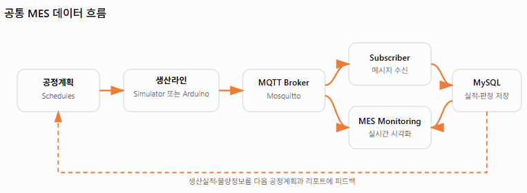

# 토이 프로젝트 5

## 컨베이어벨트 사용 공정관리 시스템

### 스마트 팩토리

- 공장 내 모든 설비와 시스템을 연결, 데이터를 기반으로 생산을 최적화하는 제조 시스템

#### 공장 시스템 종류

|시스템명|역할|사용자|
|:--:|:--|:--|
|SCM(공급체인관리)|원자재 구매, 협력업체, 물류관리|구매팀, 물류팀|
|ERP(전사적자원관리)|회사 전체 업무 관리(결과위주)|경영지원, 회계, 영업...|
|MES(생산계획관리)|생산 현장 관리|생산관리자|
|PLC(생산로직제어)|기계 제어|설비|
|SCADA|설비모니터링|생산현장|
|HMI(사람-기계 인터페이스)|작업자 화면(터치패널)|작업자|
|WMS(창고관리)|창고관리, 재고관리|물류|
|QMS(품질관리)|품질관리, 품질계획관리|품질팀|
|CMMS|설비 유지보수|설비팀|


- 공정 관리
    - MES의 한 파트인 공정(MRP: 자재소요계획)을 실시간응로 모니터링, 제어
    - 스마트팩토리로 실시간으로 양품, 불량을 선별 데이터 생성
    - Vision, IoT센서(적외선, X-ray, 스캐너...)

- IIoT - Industrial IoT. 대규모, 높은 정밀도, 고가...

### 전체 시스템 구조



### 아두이노 컨베이어벨트

#### 구성 요소

##### L298P 쉴드(HAT)

- 모터 드라이버를 포함한 아날로그 PWM, 디지털 GPIO를 
- 모터 드라이버 : 서보, DC 등 모터를 쉽게 제어할 수 있도록 모듈화


- A - 디저털핀 13개
- B - 아날로그 확장 5개
- C - 아날로그 핀 6개

- 확장핀 1 - PMW 확장편, 5V, D6, D5, GND, D3(A와 공유)
- 확장핀 2 - 초음파센서 확장핀, 5V, D8, D7, GND
- 확장핀 3 - 서브모터 확장핀, GND, 5V, D9
- 확장핀 4 - 피에조 능동 부저, D4
- 확장핀 5 - 모터제어 포트, D13, D11, D12, D10 순


#### 부저 테스트


```cpp
int buzzer = 4;

void setup() {
  Serial.begin(9600);
  pinMode(buzzer, OUTPUT);
}

void loop() {
  digitalWrite(buzzer, HIGH);
  delay(1000);
  digitalWrite(buzzer, LOW);
  delay(2000);
}

```

- DC 모터 컨베이어 테스트
    - L298P 쉴드에 최소 9V 전원인가

```cpp
int motorSpeedPin = 10;
int motorDirectionPin = 12;
int value;

void setup() {  
  pinMode(motorDirectionPin, OUTPUT);
  noTone(4);
}

void loop() {
  // 속도 증가
  digitalWrite(motorDirectionPin, HIGH);
  for (value = 0; value <= 255; value += 5) {
    analogWrite(motorSpeedPin, value);
    delay(30);
  }
  delay(1000);

  // 속도 감소
  digitalWrite(motorDirectionPin, LOW);
  for (value = 0; value <= 255; value += 5) {
    analogWrite(motorSpeedPin, value);
    delay(30);
  }
  delay(1000);
}

```


### MQTT 통신 시스템

### Unity 디지털트윈 시스템

### WPF 모니터링 시스템